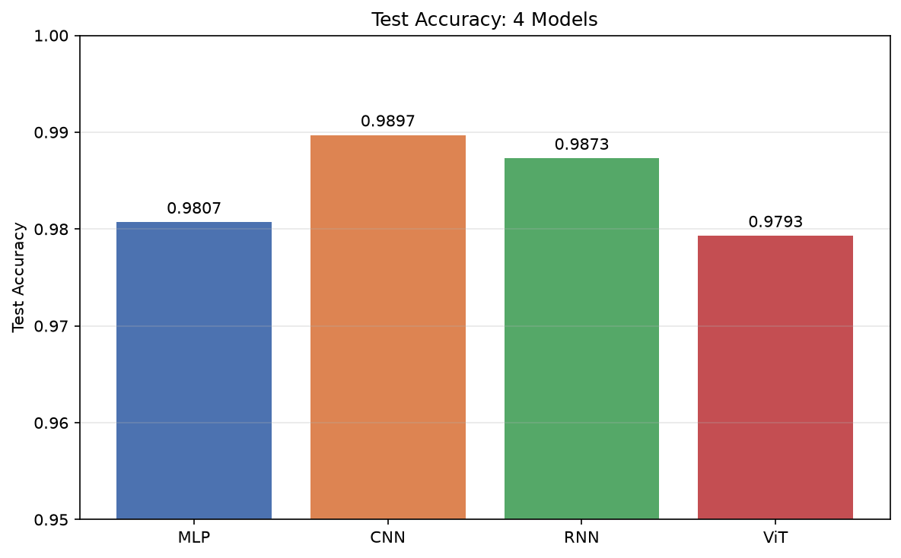
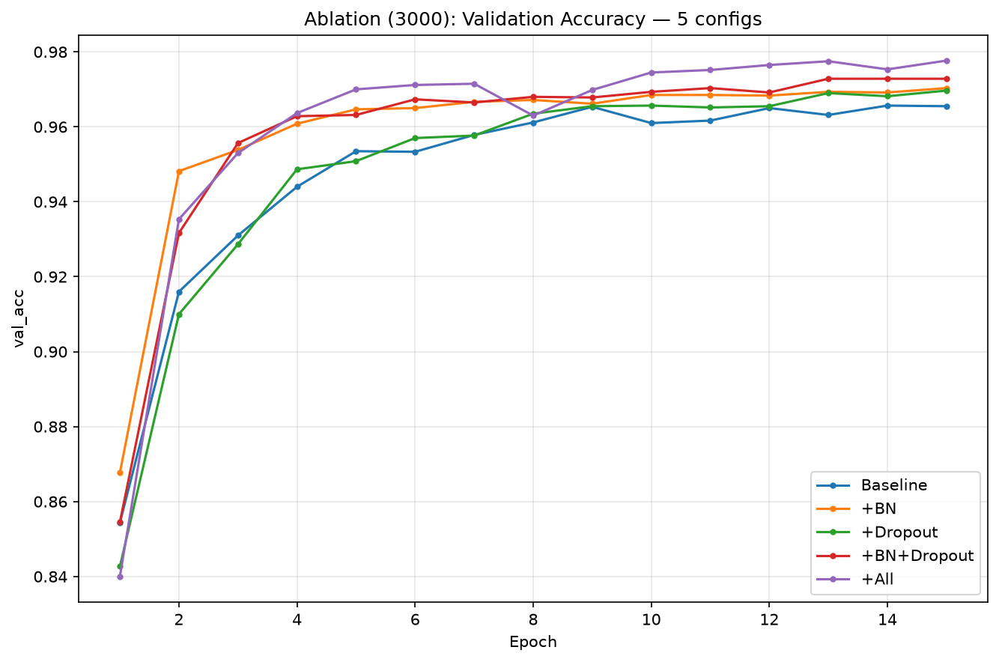
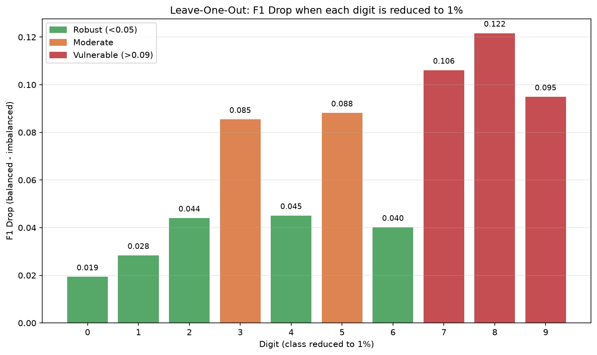

# hw_mnist_project

MNIST 손글씨 분류를 주제로 **4개 신경망 아키텍처(MLP / CNN / RNN / ViT)를 동일 조건에서 비교**하고,
**정규화 기법(BatchNorm / Dropout / Data Augmentation)의 효과**와 **클래스 불균형이 평가 지표에 미치는 영향**을
분석한 딥러닝 실험 프로젝트입니다. (2026 AILab Summer Internship 개인 프로젝트)

## 프로젝트 개요

모든 실험은 다음 공통 조건에서 수행됩니다.

- 데이터: MNIST, train/val/test = 54,000 / 6,000 / 10,000 (고정 split, seed=42)
- 학습: CrossEntropy loss, Adam, 15 epochs, batch 128
- 모델 선택: validation loss 최저 시점의 가중치 저장, test는 최종 1회만 평가
- 재현성: 모든 실험에서 `set_seed(42)`로 초기화 고정

수행한 실험은 크게 세 가지입니다.

1. **아키텍처 비교** — MLP, CNN, RNN(LSTM), ViT를 동일 조건에서 학습해 정확도·파라미터 효율·수렴 특성 비교
2. **CNN 정규화 실험** — BN / Dropout / Augmentation을 조합별로 추가하며 효과 측정.
   전체 데이터(54k)와 축소 데이터(3,000장) 두 조건에서 수행해 데이터 양에 따른 효과 차이 관찰
3. **클래스 불균형 실험** — 특정 클래스(3, 8)의 학습 데이터만 10% / 1%로 축소해
   accuracy·F1(macro/micro/per-class)의 반응 관찰. 이후 10개 숫자를 각각 단독으로 1%로 축소하는
   leave-one-out 통제 실험으로 "숫자 난이도"라는 교란 변수를 분리

## 프로젝트 구조

```
hw_mnist_project/
├── models/
│   ├── mlp.py            # MLP (flatten + FC)
│   ├── cnn.py            # CNN — use_bn / use_dropout 옵션으로 정규화 on/off
│   ├── rnn.py            # LSTM — 이미지를 행 단위 sequence(28스텝×28차원)로 처리
│   └── transformer.py    # 간단한 ViT — 7×7 patch + CLS token + TransformerEncoder
├── utils/
│   ├── data.py           # DataLoader 생성 — train_subset(축소) / augment / imbalance_classes 옵션
│   ├── train.py          # set_seed, 학습 루프(fit), best model 저장
│   ├── metrics.py        # accuracy, F1(micro/macro/weighted/per-class), confusion matrix
│   └── visualize.py      # learning curve, confusion matrix, t-SNE, 모델 비교 곡선/막대
├── notebooks/
│   └── experiments.ipynb # 전체 실험 실행·시각화 (위에서부터 순서대로 실행하면 재현)
├── results/              # 결과 그림(.png)과 지표(.json) — 모델 가중치(.pth)는 git 제외
└── requirements.txt
```

설계 특징: 모든 모델이 **feature extractor + classifier 2단 구조**를 따르고
`forward(x, return_features=True)`로 분류 직전 feature를 반환합니다.
덕분에 학습/지표/시각화(t-SNE 포함) 코드를 4개 모델이 그대로 공유합니다.

## 설치 및 실행

```bash
# 환경 생성
conda create -n mnist_proj python=3.11
conda activate mnist_proj
pip install -r requirements.txt

# 모델 단독 테스트 (구조·파라미터 수 확인)
python models/cnn.py

# 실험 실행
# notebooks/experiments.ipynb를 커널 mnist_proj로 열고 위에서부터 실행
# (MNIST는 data/에 자동 다운로드, 모든 실험 seed 고정으로 재현 가능)
```

`utils/data.py`의 `get_dataloaders()` 주요 옵션:

| 옵션 | 설명 |
|---|---|
| `train_subset=3000` | train을 3,000장으로 축소 (데이터 부족 실험) |
| `augment=True` | train에만 augmentation 적용 (±10° 회전, translate 0.05, scale 0.95–1.05) |
| `imbalance_classes=[3,8], imbalance_ratio=0.01` | 지정 클래스만 1%로 축소 (val/test는 균형 유지) |

## 주요 결과

**아키텍처 비교** (균형 MNIST 54k)

| 모델 | Test acc | 특징추출 params | best epoch |
|---|---|---|---|
| CNN | 0.9897 | 18,816 | 6 |
| RNN | 0.9873 | ~212,000 | 12 |
| MLP | 0.9807 | 233,856 | 12 |
| ViT | 0.9793 | ~272,000 | 13 |



**정규화 실험** (CNN, 전체 vs 축소 데이터)

| 구성 | 전체 54k | 축소 3k |
|---|---|---|
| Baseline | 0.9899 | 0.9692 |
| +BN | 0.9900 | 0.9728 |
| +Dropout | 0.9924 | 0.9721 |
| +BN+Dropout | 0.9910 | 0.9750 |
| +All (+Aug) | — | 0.9809 |



**클래스 불균형** (3·8 축소, plain CE)

| | 10% | 1% |
|---|---|---|
| Accuracy | 0.9834 | 0.9644 |
| Macro-F1 | 0.9832 | 0.9629 |
| 숫자 8 F1 | 0.9684 | 0.8866 |

**Leave-one-out** — 각 숫자를 단독으로 1% 축소했을 때 해당 숫자의 F1 하락폭:



주요 발견 요약:

- 균형 MNIST에서는 4개 아키텍처가 0.98±0.01로 수렴해 구조 차이가 거의 드러나지 않음
- 정규화 효과는 전체 데이터에서 +0.25%p로 미미했으나 축소 데이터에서 +1.2%p로 뚜렷 (augmentation 기여 최대)
- 극단적 불균형에서도 accuracy·macro-F1은 0.96대를 유지하지만 per-class F1은 숫자 8의 붕괴(recall 0.80)를 드러냄
- leave-one-out 결과 F1 하락폭이 숫자별로 6배 차이 (0.019~0.122) — 데이터 부족은 형태가 복잡한 숫자(7, 8, 9)에 더 치명적

## 환경

- GPU: RTX 4060 Ti (16GB), CUDA 12.4
- Python 3.11, PyTorch 2.6, scikit-learn, matplotlib, seaborn